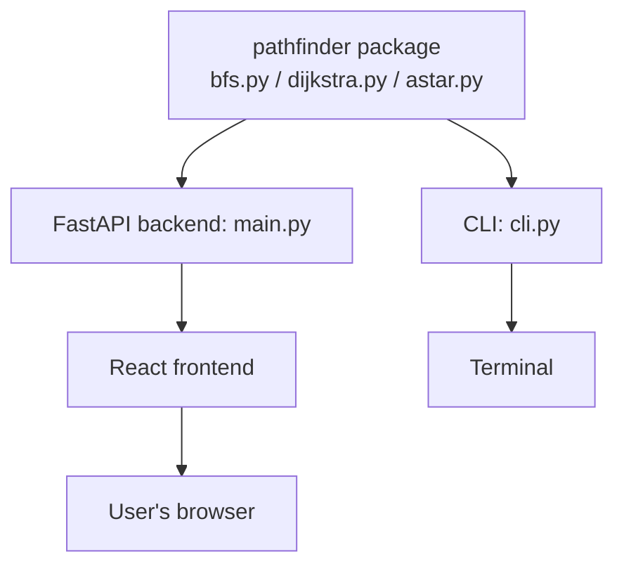
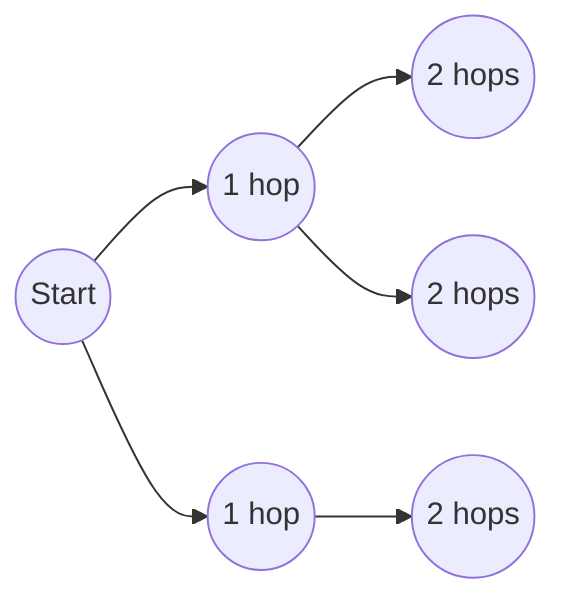
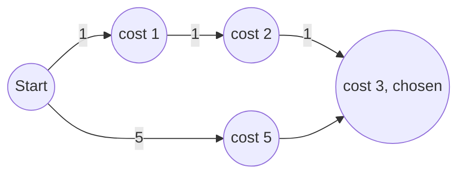
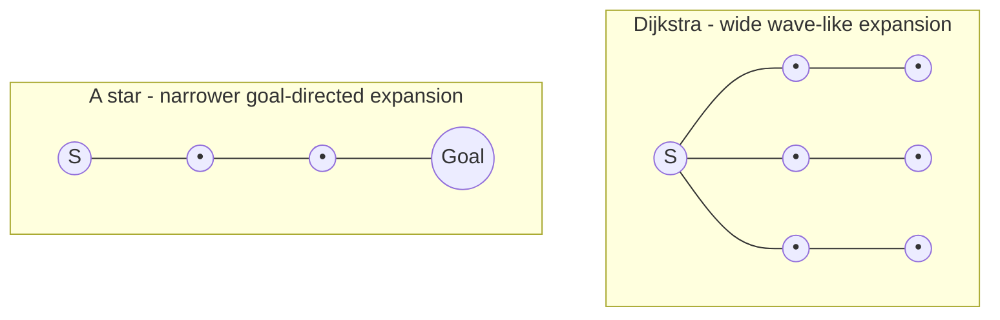

# pathfinder-cli


[](https://pypi.org/project/pathfinder-cli/)

BFS, Dijkstra, and A* pathfinding — implemented entirely from scratch, no graph libraries.

### 🔗 [Live Demo](https://pathfinder-cli.vercel.app)

## Description

pathfinder-cli implements BFS, Dijkstra, and A* from scratch in Python on a weighted grid — no networkx, no igraph, no scipy, stdlib only. It's extended with a FastAPI + React web visualiser that imports and runs the exact same `pathfinder` package as the CLI, so there is zero duplicated algorithm logic between the terminal tool and the web app. Both surfaces are backed by the same 23-test pytest suite validating correctness and cross-algorithm agreement. Built to fill a DSA-from-scratch gap in a portfolio otherwise focused on LLM/agent projects.

## Features

### Core algorithms

- BFS, Dijkstra, A* — all hand-written, no graph/shortest-path libraries
- Lazy deletion priority queue pattern (Python's `heapq` has no decrease-key)
- Admissible Manhattan distance heuristic for A*
- Deterministic seeded grid generation — fully reproducible results

### Web visualiser

- **Real-time animated visualisation** — see the algorithms diverge, not just read numbers in a table
- **Adjustable grid size, wall density, animation speed** — stress-test how algorithm behaviour changes with density
- **Click-to-edit grid mode** — build a specific maze/corridor scenario and see exactly how each algorithm handles it
- **Terrain cost heatmap overlay** — makes cost-avoidance behaviour visually obvious instead of requiring you to read numbers off cells
- **Path replay** — isolate the final path from exploration noise, useful for explaining the result to someone else
- **Shareable URLs** — grid config encoded in the URL, so a specific result is reproducible and linkable rather than a one-off screenshot

## Demo

### 🔗 [https://pathfinder-cli.vercel.app](https://pathfinder-cli.vercel.app)

Open the live site, pick a grid size, seed, and wall density, then hit Run — all three algorithms animate side by side with live node counters as they explore the grid, and once they finish, the comparison table populates with each algorithm's path cost, nodes explored, and timing so you can see the trade-offs directly.

## Tech Stack

### Core algorithms

- Python 3.10+, stdlib only (`heapq`, `collections.deque`, `dataclasses`)
- pytest (23 tests), GitHub Actions CI

### Web visualiser

- Backend: FastAPI, Pydantic — deployed on Render
- Frontend: React, Vite — deployed on Vercel



Same algorithm code powers both the CLI and the web app — single source of truth, zero duplication.

## Installation

### Install from PyPI (recommended)

```
pip install pathfinder-cli
```

### Install from source (for development)

```
pip install -e .
```

### Web app

```
cd pathfinder_web/backend
pip install -r requirements.txt
cd ../frontend
npm install
```

## Usage

### CLI

#### Basic usage

Each algorithm can be run independently with the same `--start`/`--end` coordinates:

```bash
pathfinder --algo bfs --start 0,0 --end 19,19
pathfinder --algo dijkstra --start 0,0 --end 19,19
pathfinder --algo astar --start 0,0 --end 19,19
```

Example output (`--algo astar --start 0,0 --end 9,9 --rows 10 --cols 10 --render`):

```
+-------------------+
|S * 5 # 3 # . # 3 #|
|# * * * * . . . # .|
|3 . 3 # * 5 . 5 # .|
|. 2 5 . * 5 5 # 3 .|
|. 5 . . * * * 3 . 2|
|5 . # 3 3 3 * * . .|
|# # 3 # 2 3 . * 3 5|
|. 2 # 5 3 3 5 * . #|
|3 3 3 . # . . * # .|
|3 . 3 # 3 . 5 * * E|
+-------------------+
Algorithm  : astar
Grid       : 10 × 10  (seed 42)
Start      : (0, 0)   →   End : (9, 9)
─────────────────────────────────────────────
Path found : Yes
Path cost  : 35.0
Path length: 19 steps
Nodes expl : 71
Query time : 0.000 s
```

#### Customizing the grid

```bash
pathfinder --algo astar --start 0,0 --end 49,49 --rows 50 --cols 50
```

`--rows` and `--cols` control the grid's dimensions — start and end coordinates must fall within them.

#### Reproducible results with seeds

```bash
pathfinder --algo dijkstra --start 0,0 --end 24,33 --rows 25 --cols 35 --seed 42
```

The same `--seed` always generates the same grid, so anyone can reproduce your exact result by running the same command.

#### Visualizing the path in your terminal

```bash
pathfinder --algo astar --start 0,0 --end 9,9 --rows 10 --cols 10 --render
```

`--render` prints the ASCII grid with the path traced through it — walls are `#`, terrain costs are digits, and start/end are `S`/`E` (see the example output under Basic usage above).

#### Comparing all algorithms at once

```bash
pathfinder --all --start 0,0 --end 19,19
```

`--all` runs BFS, Dijkstra, and A* on the same grid and prints a side-by-side comparison table of cost, nodes explored, and time for each.

Example output:

```
Grid: 20 × 20   Seed: 42   Query: (0,0) → (19,19)
──────────────┬──────────┬───────────────┬──────────
Algorithm     │ Cost     │ Nodes explored│ Time (s)
──────────────┼──────────┼───────────────┼──────────
BFS           │ 38.0     │ 330            │ 0.001
Dijkstra      │ 69.0     │ 330            │ 0.001
A*            │ 69.0     │ 330            │ 0.001
──────────────┴──────────┴───────────────┴──────────
Note: BFS cost = hop count. Dijkstra/A* cost = weighted terrain sum.
```

#### Seeing all available options

```bash
pathfinder --help
```

#### Full flag reference

| Flag        | Required | Description                                          |
|-------------|----------|-------------------------------------------------------|
| `--algo`    | Yes (unless `--all`) | Algorithm to run: `bfs`, `dijkstra`, or `astar` |
| `--start`   | Yes      | Start coordinate as `row,col`                          |
| `--end`     | Yes      | End coordinate as `row,col`                            |
| `--rows`    | No (default `20`) | Number of grid rows                              |
| `--cols`    | No (default `20`) | Number of grid columns                           |
| `--seed`    | No (default `42`)  | Random seed for grid generation                 |
| `--render`  | No (default off)   | Print the ASCII grid with the path highlighted  |
| `--all`     | No (default off)   | Run all 3 algorithms and print a comparison table |

#### Benchmark

```
Grid: 100 × 100   Seed: 42   Query: (0,0) → (98,99)
──────────────┬──────────┬───────────────┬──────────
Algorithm     │ Cost     │ Nodes explored│ Time (s)
──────────────┼──────────┼───────────────┼──────────
BFS           │ 197.0    │ 7,967          │ 0.013
Dijkstra      │ 285.0    │ 7,965          │ 0.019
A*            │ 285.0    │ 7,700          │ 0.021
──────────────┴──────────┴───────────────┴──────────
Note: BFS cost = hop count. Dijkstra/A* cost = weighted terrain sum.
```

### Web app (local)

```
# Terminal 1
cd pathfinder_web/backend
uvicorn main:app --reload

# Terminal 2
cd pathfinder_web/frontend
npm run dev
```

Then open http://localhost:5173

### Using it as a Python library

Since `pathfinder-cli` is a pip package, its algorithms can also be imported and called directly instead of going through the CLI:

```python
from pathfinder.grid import Grid
from pathfinder.generator import generate_grid
from pathfinder.bfs import bfs
from pathfinder.dijkstra import dijkstra
from pathfinder.astar import astar

grid = generate_grid(rows=20, cols=20, seed=42)
result = astar(grid, start=(0, 0), end=(19, 19))

print(result.path)
print(result.cost)
print(result.nodes_explored)
```

### CLI vs Web App — which should you use?

|                              | CLI (`pip install pathfinder-cli`) | Web App |
|------------------------------|-------------------------------------|---------|
| Access                       | Terminal, after pip install         | Just open the URL |
| Interface                    | Text output                         | Animated, visual |
| Requires Python              | Yes                                  | No |
| Usable as a Python library   | Yes                                  | No |
| Custom grid editing          | No                                   | Yes (click-to-edit) |
| Setup needed                 | pip install                          | None |

Both use the exact same underlying algorithm code — see the architecture diagram under Tech Stack.

### How the algorithms work

#### BFS

BFS explores the grid layer by layer outward from the start, using a FIFO queue (`collections.deque`) so the first time it reaches any cell is guaranteed to be via the fewest hops. Every edge has an implicit weight of 1, so it ignores terrain cost entirely — it optimises purely for hop count.



Time complexity: **O(V + E)**, where V is the number of cells in the grid and E is the number of edges between orthogonally adjacent cells. Use BFS when all moves cost the same and you only care about the shortest hop count, not terrain cost.

```
queue = deque([start])
visited = {start}
while queue:
    current = queue.popleft()
    if current == end:
        return reconstruct_path(current)
    for neighbor in grid.neighbors(current):
        if neighbor not in visited:
            visited.add(neighbor)
            queue.append(neighbor)
```

#### Dijkstra

Dijkstra explores cells in order of lowest accumulated cost using a min-heap. Python's `heapq` has no decrease-key operation, so instead of updating a node's priority in place, a cheaper duplicate entry is pushed whenever a shorter path to that cell is found, and a `settled` set is checked on pop to skip any stale, already-settled entries left behind in the heap.



Time complexity: **O((V + E) log V)** due to heap push/pop operations, where V is the number of cells and E is the number of edges. Use Dijkstra when terrain costs vary and you need the guaranteed lowest-cost path with no further information about where the target is.

```
heap = [(0, start)]
g_cost = {start: 0}
settled = set()
while heap:
    cost, current = heappop(heap)
    if current in settled:
        continue
    settled.add(current)
    if current == end:
        return reconstruct_path(current)
    for neighbor in grid.neighbors(current):
        new_cost = cost + neighbor.cost
        if new_cost < g_cost.get(neighbor, inf):
            g_cost[neighbor] = new_cost
            heappush(heap, (new_cost, neighbor))
```

#### A*

A* extends Dijkstra by adding a Manhattan-distance heuristic `h` to the priority order, so cells are popped in order of `f = g + h` (accumulated cost plus estimated remaining distance) instead of `g` alone. Manhattan distance is admissible for 4-directional grid movement because it never overestimates the true remaining cost — the minimum number of moves to the goal is always at least the Manhattan distance. This biases the search to expand toward the goal rather than uniformly in all directions, so A* finds the identical optimal cost as Dijkstra while exploring far fewer nodes.



Time complexity: **O((V + E) log V)** in the worst case, same as Dijkstra, but with a much smaller practical constant since fewer nodes are ever pushed onto the heap. Use A* whenever the target's coordinates are known in advance.

```
h = manhattan(start, end)
heap = [(h, 0, start)]
g_cost = {start: 0}
settled = set()
while heap:
    f, g, current = heappop(heap)
    if current in settled:
        continue
    settled.add(current)
    if current == end:
        return reconstruct_path(current)
    for neighbor in grid.neighbors(current):
        new_g = g + neighbor.cost
        if new_g < g_cost.get(neighbor, inf):
            g_cost[neighbor] = new_g
            new_f = new_g + manhattan(neighbor, end)
            heappush(heap, (new_f, new_g, neighbor))
```

### Why the algorithms perform differently

|                        | BFS         | Dijkstra    | A*                     |
|------------------------|-------------|-------------|------------------------|
| Optimises for          | fewest hops | lowest cost | lowest cost, fewer nodes |
| Terrain-aware          | No          | Yes         | Yes                    |
| Heuristic              | None        | None        | Manhattan distance     |
| Typical nodes explored | most        | more        | least                  |

A*'s advantage over Dijkstra shrinks on dense, maze-like grids — forced detours around walls leave little room for the heuristic to prune, since most of the grid has to be explored regardless of direction. Its advantage grows on open, sparse grids, where a clear line of sight to the goal lets the heuristic guide the search almost directly there instead of expanding uniformly outward.

## Project Structure

```
pathfinder/          — core algorithms, shared by CLI and web app
pathfinder_web/
  backend/           — FastAPI wrapper around pathfinder package
  frontend/          — React visualiser
tests/                — pytest suite (23 tests)
benchmark.py          — reproducible benchmark script
```

## Configuration

- **Frontend**: `VITE_API_URL` in `pathfinder_web/frontend/.env` — points to the backend URL. Defaults to `http://127.0.0.1:8000` for local dev; set to the Render URL in Vercel's environment variables for production.
- **Backend**: no configuration needed — CORS allows all origins, no secrets or API keys required.

## API Documentation

Base URL (production): `https://pathfinder-cli-api.onrender.com`

### `GET /api/health`

Returns:
```json
{"status": "ok"}
```

### `POST /api/run`

Request body:
```json
{
  "rows": 25,
  "cols": 35,
  "seed": 42,
  "start": [0, 0],
  "end": [24, 33],
  "wall_probability": 0.20,
  "custom_grid": null
}
```

Response: the generated `grid` plus one result object each for `bfs`, `dijkstra`, and `astar`, where each result contains:

| Field | Description |
|---|---|
| `visited_order` | Cells in the order they were explored |
| `path` | Final path from start to end, or `null` if unreachable |
| `cost` | Total path cost |
| `nodes_explored` | Number of cells explored |
| `elapsed_ms` | Wall-clock run time in milliseconds |
| `memory_mb` | Peak traced memory in megabytes |

## Testing

- 23 pytest tests across the grid model, each algorithm, and cross-algorithm agreement checks
- Run: `pytest tests/ -v`
- CI runs the full suite on every push via GitHub Actions

## Roadmap

- [ ] C++ reimplementation of the same algorithms for performance comparison
- [ ] 8-directional movement with adjusted heuristic
- [ ] Multi-agent simultaneous pathfinding
- [ ] Network/graph mode (non-grid topologies)

## Author

**Sriharinesh Sureshkumar**
IIT Kharagpur — B.Tech Mining Engineering
GitHub: [Sriharinesh-Sureshkumar](https://github.com/Sriharinesh-Sureshkumar)

## Acknowledgements

Built as a portfolio project to demonstrate algorithms-from-scratch fundamentals alongside full-stack deployment skills.
